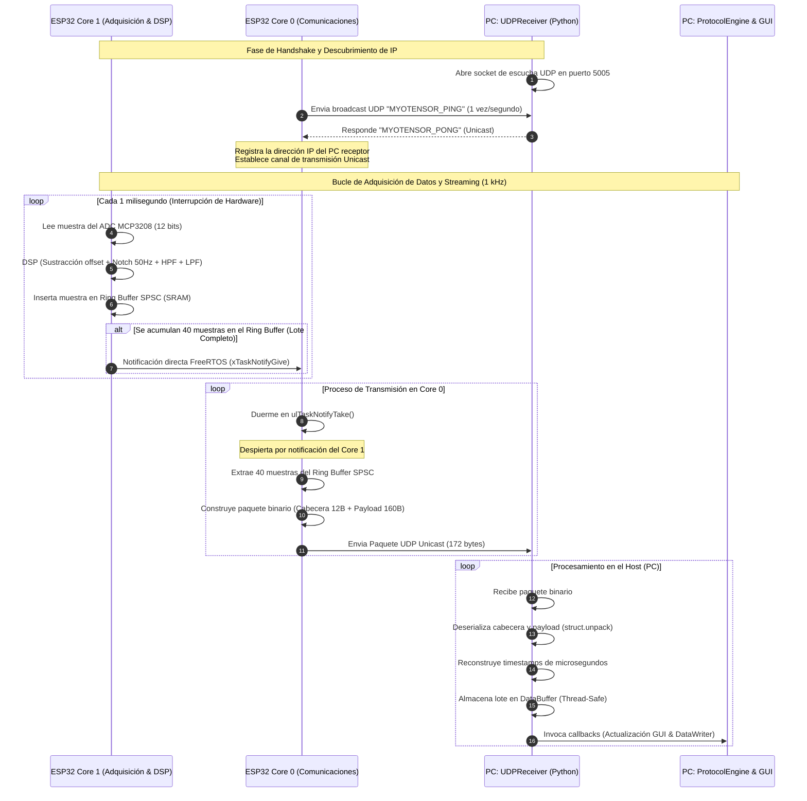
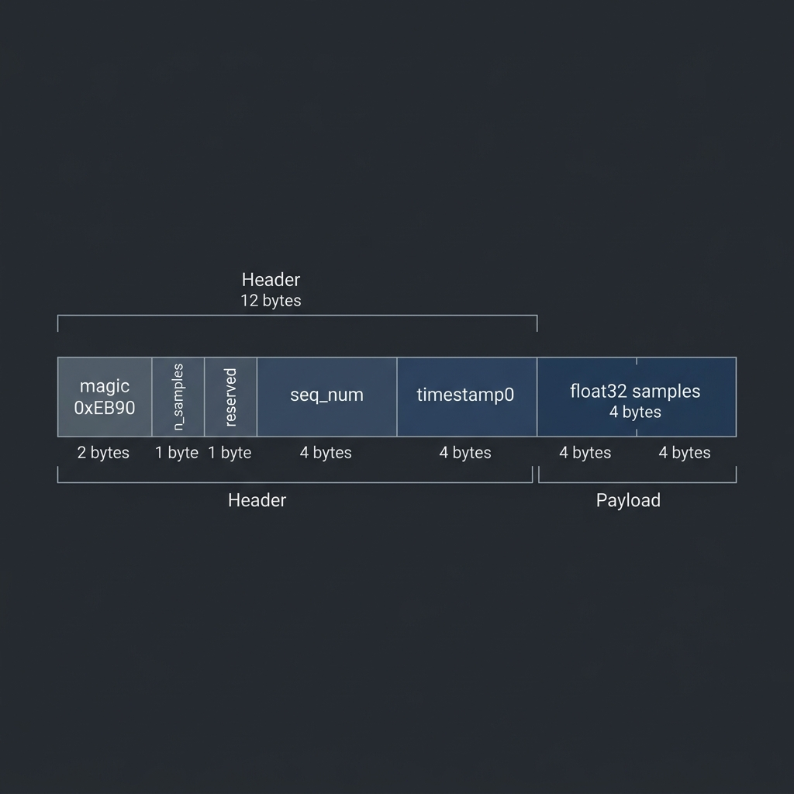
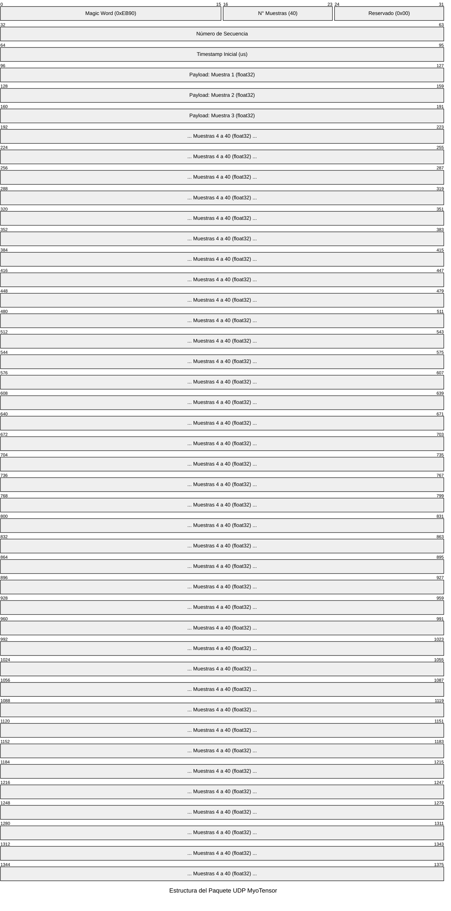

# Metodología de Adquisición de Datos: MyoTensor

Esta sección describe detalladamente el sistema de adquisición de señales electromiográficas (EMG) diseñado e implementado para el proyecto MyoTensor. El proceso se divide en tres componentes fundamentales: el **Firmware de Adquisición**, el **Software de Adquisición** y el **Protocolo de Adquisición**, los cuales interactúan de forma coordinada para garantizar un flujo continuo, de baja latencia y alta fidelidad para el entrenamiento de los modelos de inteligencia artificial.

---

## 1. Firmware de Adquisición

El firmware de adquisición se ejecuta sobre el sistema en chip (SoC) **Seeed Studio XIAO ESP32-S3**, el cual cuenta con un microprocesador de doble núcleo Tensilica Xtensa LX7 a 240 MHz y soporte de instrucciones vectoriales. Este hardware interactúa mediante el bus periférico serie (SPI) con un conversor analógico-digital (ADC) externo **MCP3208** de 12 bits de resolución.

Para cumplir rigurosamente con los requisitos de muestreo en tiempo real sin introducir retrasos (*jitter*) debido a la pila de comunicaciones inalámbricas, el firmware adopta una arquitectura asíncrona de doble núcleo gestionada por el sistema operativo en tiempo real **FreeRTOS**:

### Distribución de Tareas en Doble Núcleo
1. **Core 1 (Tarea de Adquisición - `taskAcquisicion`)**:
   * **Prioridad**: Alta (5).
   * **Frecuencia**: 1000 Hz ($F_s = 1$ kHz), controlada por un temporizador periódico de hardware de precisión libre de deriva acumulada (`vTaskDelayUntil`).
   * **Función**: Lee de manera directa el canal 0 del ADC MCP3208 mediante transacciones SPI optimizadas. Aplica una etapa de preprocesamiento digital de señales (DSP) en coma flotante:
     * **Sustracción de Offset**: Resta el nivel de corriente continua basal ($V_{REF} \approx 1.48$ V, equivalente a 1837 cuentas en el ADC de 12 bits) para centrar la señal en cero.
     * **Filtro Notch (50 Hz)**: Elimina la interferencia de la red eléctrica comercial.
     * **Filtro Pasa-Altos (HPF)**: Filtra los artefactos de movimiento de baja frecuencia.
     * **Filtro Pasa-Bajos (LPF)**: Limita el ancho de banda y evita el efecto de aliasing.
   * **Almacenamiento**: Escribe cada muestra procesada en un búfer circular de tipo *Single Producer Single Consumer* (SPSC) alojado en la SRAM interna del chip.

2. **Core 0 (Tarea de Transmisión - `taskUDP`)**:
   * **Prioridad**: Media (3).
   * **Función**: Se encarga del empaquetado binario y de la transmisión inalámbrica mediante el protocolo UDP.
   * **Sincronización**: Para lograr un consumo mínimo de recursos de CPU, la tarea de transmisión permanece suspendida mediante el mecanismo de notificaciones rápidas de FreeRTOS (`ulTaskNotifyTake`). Una vez que la tarea de adquisición (Core 1) acumula un lote completo de datos (`BATCH_SIZE = 40` muestras, correspondiente a 40 ms de señal), envía una señal directa (`xTaskNotifyGive`) al Core 0 para despertarlo, procediendo a conformar el paquete UDP y enviarlo de forma inmediata.

### Mecanismos de Robustez y Optimización de Red
* **Búfer Circular SPSC**: Configurado con un tamaño de 2048 muestras ($2^{11}$ slots en memoria para permitir direccionamiento bit a bit con máscaras, optimizando la velocidad del procesador). Proporciona un margen temporal de $\approx 2$ segundos de amortiguación. Si ocurre pérdida temporal de conexión o congestión en el medio inalámbrico, las muestras se retienen en SRAM evitando pérdidas de datos puntuales.
* **Desactivación de WiFi Power Save (`WIFI_PS_NONE`)**: Evita que el transceptor de radio entre en modo de suspensión (comportamiento por defecto para ahorrar batería), eliminando picos de latencia de decenas de milisegundos que desbordarían la pila lwIP.
* **Ajuste de Potencia RF (`WIFI_POWER_8_5dBm`)**: Se limita la potencia de transmisión del módulo WiFi a 8.5 dBm. Esto reduce el consumo pico de corriente del circuito a niveles seguros (evitando caídas bruscas de tensión en la línea de alimentación VCC) y minimiza la radiación electromagnética que podría acoplarse e introducir ruido en la etapa analógica del ADC.
* **Auto-Descubrimiento Unicast**: Durante el inicio, el dispositivo realiza un proceso de handshake transmitiendo un ping en broadcast. Al recibir la confirmación del host receptor, fija su IP para realizar streaming de forma estrictamente unicast. Esto evita saturar el medio físico con transmisiones multicast/broadcast de baja prioridad de velocidad y optimiza la tasa de transferencia en la red local.

---

## 2. Software de Adquisición

El software receptor y de control del experimento está desarrollado en **Python** y estructurado con una interfaz gráfica basada en la biblioteca **PyQt5**. Su arquitectura interna está diseñada para operar de forma desacoplada mediante hilos de ejecución concurrentes, lo cual garantiza que la visualización gráfica no bloquee ni altere la recolección en tiempo real de los datos.

Los módulos principales del software son:

* **Búfer de Datos de Alta Velocidad (`DataBuffer`)**: Es un búfer de tamaño fijo configurado de forma *thread-safe* mediante bloqueos mutuos (`threading.Lock`). Permite la inserción rápida por lotes desde el hilo de comunicaciones y ofrece la posibilidad de extraer "capturas" instantáneas (*snapshots*) de la señal para la graficación en tiempo real a 30 FPS en la interfaz gráfica.
* **Hilo Receptor de Red (`UDPReceiver`)**: Ejecutado como un hilo daemon en segundo plano. Escucha en el puerto UDP 5005, responde al protocolo de handshake enviando la palabra de control `MYOTENSOR_PONG`, y procesa la trama binaria entrante. La deserialización eficiente de la cabecera y el payload se realiza mediante la biblioteca nativa `struct` de Python, convirtiendo el flujo de bytes directamente en arreglos numéricos de `NumPy`.
* **Motor del Experimento (`ProtocolEngine`)**: Consiste en una máquina de estados finitos que orquesta los tiempos, transiciones y la secuencia del protocolo de adquisición. Emite señales de Qt para actualizar el estado del estímulo en pantalla e interactúa con el escritor de archivos.
* **Calibrador del Sistema (`Calibrator`)**: Módulo responsable de realizar dos tareas de calibración iniciales:
  1. *Estimación de Ruido Basal*: Determina la desviación estándar del ruido electromiográfico en reposo absoluto.
  2. *Máxima Contracción Voluntaria (MVC)*: Registra los límites superiores de amplitud muscular del usuario durante un esfuerzo máximo, datos que son críticos para normalizar la amplitud de la señal EMG.
* **Escritor de Datos (`DataWriter`)**: Escribe en disco los archivos resultantes en formato CSV estructurado. Los datos son almacenados en la ruta de desarrollo `intelligence/datasets/raw`, etiquetando de forma precisa cada muestra con su timestamp de microsegundos, el valor de amplitud de la señal filtrada y el identificador de estímulo (gesto activo) correspondiente.

---

## 3. Protocolo de Adquisición

El protocolo de adquisición implementa un **Diseño de Bloques Aleatorizados** (Randomized Block Design), con el propósito de mitigar los sesgos provocados por el cansancio muscular (fatiga), la anticipación de movimientos por parte del usuario o la adaptación neuronal a secuencias repetitivas.

La sesión completa se estructura en la siguiente línea de tiempo secuencial:

```
[Inicio] ──> [Calibración Ruido (5s)] ──> [Calibración MVC (3s)] ──> [Pausa Transición (2s)] ──> [Sets 1 a 10] ──> [Fin de Sesión]
```

### Detalle de las Etapas
1. **Fase de Calibración de Ruido (5.0 segundos)**: El usuario permanece en estado de reposo absoluto. El sistema calcula la media y desviación estándar de la señal para fijar el umbral basal y el algoritmo de detección de inicio de contracción (*onset*).
2. **Fase de Calibración MVC (3.0 segundos)**: El usuario ejerce la máxima contracción muscular voluntaria permitida por su anatomía. Esto define el factor de escala superior para la normalización.
3. **Bloques de Adquisición (Sets)**:
   * Se ejecutan un total de **$N_{sets} = 10$** bloques.
   * Cada bloque contiene una permutación aleatoria de la lista de gestos definidos (p. ej., Palma Abierta, Puño Cerrado, Gesto de Paz). Ningún gesto se repite dentro del mismo set.
   * **Ciclo Rest-First**: Cada gesto activo es precedido por un período de descanso de **3.0 segundos** (Rest). Durante este descanso, la interfaz gráfica de usuario cambia de estado para mostrar cuál es el siguiente gesto que se va a solicitar. Esto le da tiempo al usuario para preparar mentalmente el movimiento y relajar la musculatura.
   * **Contracción Activa**: El gesto se sostiene de manera continua durante **5.0 segundos** (Gesture Active). Durante este intervalo, la señal recopilada se asocia con el identificador del gesto correspondiente.

---

## 4. Diagrama de Flujo del Sistema

El siguiente diagrama detalla la interacción entre el microcontrolador (Firmware) y la computadora (Software), ilustrando las fases de descubrimiento de red, el flujo asíncrono en doble núcleo y la recepción y persistencia de las muestras de datos:



---

## 5. Estructura del Paquete de Datos UDP

Para maximizar la eficiencia y reducir el overhead de transmisión, el protocolo de adquisición utiliza un paquete binario plano con codificación *little-endian* sin alineación de bytes (*padding*). La estructura consta de una cabecera de 12 bytes seguida de un payload variable de datos de punto flotante de 32 bits (`float32`), según el tamaño del lote configurado (`BATCH_SIZE = 40` muestras):

* **Magic Word (2 bytes - `uint16`)**: Código de sincronismo fijo (`0xEB90`). Permite validar el origen e integridad mínima del paquete en el receptor.
* **Número de Muestras (1 byte - `uint8`)**: Cantidad de muestras contenidas en el payload ($N = 40$).
* **Reservado (1 byte - `uint8`)**: byte de alineación o uso futuro (`0x00`).
* **Número de Secuencia (4 bytes - `uint32`)**: Contador correlativo incremental de paquetes. Permite al software receptor cuantificar de manera exacta la pérdida de paquetes debido a la congestión de la red inalámbrica.
* **Timestamp Inicial (4 bytes - `uint32`)**: Tiempo del reloj del sistema (en microsegundos) de la primera muestra contenida en el paquete.
* **Payload (160 bytes - `float32[40]`)**: Secuencia contigua de 40 muestras procesadas por la etapa DSP, codificadas en coma flotante de precisión simple (4 bytes por muestra).

La siguiente ilustración detalla la distribución en memoria de los campos que componen la trama de red UDP:



También se puede representar mediante el siguiente diagrama de bits interactivo:



