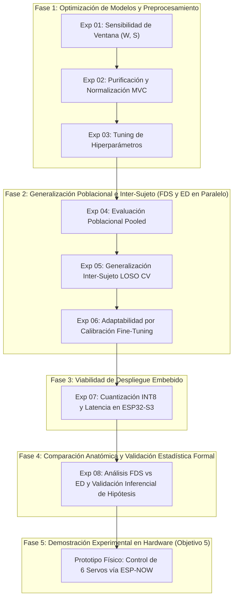

# Plan de Experimentos - MyoTensor

Este documento define y organiza la secuencia metodológica de experimentos para la evaluación y selección del modelo de Inteligencia Artificial óptimo a **1 solo canal sEMG** y de naturaleza **espaciotemporal**, operando sobre el dataset propio de 10 sujetos recolectado con `dataset_collector`.

---

## Objetivos del proyecto

**Título:** Evaluación comparativa de modelos de Aprendizaje Automático/Profundo para la clasificación de señales electromiográficas de superficie (sEMG) en tiempo real mediante un sistema embebido ESP32-S3.

**Objetivo General:** Evaluar comparativamente el rendimiento de modelos de Machine Learning (Support Vector Machine & Random Forest) y de Deep Learning (CNN-LSTM & CNN-TCN) en la clasificación de gestos sEMG en tiempo real ejecutado en un microcontrolador XIAO ESP32-S3 y analizando el impacto de la ubicación muscular.

**Objetivos específicos:**
  1. Analizar el estado del arte en procesamiento de señales sEMG y modelos de aprendizaje automático embebido.
  2. Recopilar un conjunto de datos sEMG etiquetado bajo un protocolo de adquisición, asegurando robustez estadística.
  3. Implementar modelos de aprendizaje automático embebidos de forma óptima para clasificar las señales sEMG del conjunto de datos.
  4. Contrastar el rendimiento de las implementaciones basado en métricas de desempeño en tiempo real.
  5. Validar la aplicabilidad del sistema mediante la integración experimental del modelo óptimo a un prototipo de brazo robótico.

**Hipótesis:** El uso de un modelo de Deep Learning tiene un mejor desempeño en la clasificación de patrones sEMG en un canal en comparación con los modelos de Machine Learning clásico sin importar la ubicación muscular.

---

## 🎯 Objetivos de la Investigación

1. **Optimización de Modelos**: Determinar la mejor configuración de preprocesamiento e hiperparámetros para 4 propuestas distintas:
   - **Machine Learning Clásico**: Random Forest (RF) y Support Vector Machine (SVM).
   - **Deep Learning Espaciotemporal**: 1D-CNN + LSTM (CNN-LSTM) y 1D-CNN + Temporal Convolutional Network (CNN-TCN).
2. **Evaluación Anatómica Dual en Paralelo**: Evaluar **ambos grupos musculares a 1 solo canal** (Flexor **FDS** y Extensor **ED**) a lo largo de todo el pipeline experimental, garantizando evidencia empírica suficiente para contrastar la hipótesis (*"sin importar la ubicación muscular"*).
3. **Evaluación de Generalización Poblacional e Inter-Sujeto**: Cuantificar la capacidad de generalización poblacional agregada (*Pooled*), la robustez *Plug-and-Play* inter-sujeto (*Leave-One-Subject-Out CV*) y el impacto adaptativo del *Fine-Tuning* (calibración rápida de 3 a 5 segundos).
4. **Factibilidad en Hardware Embebido**: Analizar el *trade-off* multidimensional entre Precisión vs Latencia vs Huella de Memoria tras la cuantización **INT8** (TensorFlow Lite Micro) para despliegue final en **ESP32-S3**.
5. **Validación Inferencial de Hipótesis y Demostración en Prótesis**: Aplicar pruebas estadísticas pareadas formales ($\\alpha = 0.05$) al final de todos los experimentos para contrastar formalmente la hipótesis, justificar la elección del músculo óptimo e integrar el sistema completo al prototipo de brazo robótico articulado con 6 servomotores.

---

## 🗺️ Mapa de Ruta del Flujo Experimental

---

## 🧪 Fase 1: Optimización de Modelos y Preprocesamiento

### Experimento 01: Configuración de Sensibilidad de Ventana (Window Sliding)
* **Estado:** Completado / Existente (`01_Sensibilidad_Ventana.ipynb`)
* **Objetivo:** Encontrar el tamaño óptimo de la ventana temporal ($W \in \{100, 200, 300, 400\}\text{ ms}$) y el porcentaje de solapamiento ($S \in \{25, 50, 100\}\text{ ms}$) en la segmentación de la señal sEMG. Se busca el mejor balance entre resolución temporal (menor latencia) y cantidad de información para lograr una clasificación precisa.
* **Flujo Detallado Paso a Paso:**
  * **Input:** Dataset crudo con las señales sEMG de los gestos de un sujeto de prueba representativo (ej. `S01`).
  * **Paso 1 (Carga y Segmentación):** Iterar sobre una malla predefinida de parámetros usando `load_and_segment_dataset`.
  * **Paso 2 (Extracción/Formateo):** Para los modelos clásicos (SVM, RF), extraer características temporales (MAV, RMS, WL, ZC, SSC, VAR) y escalar con `StandardScaler`. Para DL (CNN-LSTM, CNN-TCN), retener los tensores de onda temporal cruda ($W, 1$).
  * **Paso 3 (Entrenamiento por Malla):** Entrenar los 4 modelos (SVM, RF, CNN-LSTM, CNN-TCN) para cada combinación.
  * **Paso 4 (Evaluación):** Obtener el Accuracy y F1-Score en el conjunto de Test para esa combinación específica.
  * **Output 1 (Visual):** Mapas de calor (*Heatmaps*) de Accuracy/F1 vs Window/Stride.
  * **Output 2 (Artefacto):** Actualización automática del archivo `config.py` con el diccionario `BEST_PARAMS`.

### Experimento 02: Purificación del Dataset y Normalización por MVC
* **Estado:** Por construir (`02_Purificacion_y_Normalizacion.ipynb`)
* **Objetivo:** Cuantificar el impacto del filtrado de datos inestables (retener la fase *steady-state* eliminando transiciones ruidosas del inicio/fin del gesto) y la normalización respecto a la Máxima Contracción Voluntaria ($\%\text{MVC}$) frente a señales crudas en mV/ADC.
* **Flujo Detallado Paso a Paso:**
  * **Input:** Datasets crudos de los 10 sujetos con registros de calibración basal (Ruido) y MVC para ambos músculos (FDS y ED).
  * **Paso 1 (Filtrado de Transiciones):** Recortar bordes de transición de contracción activa para conservar sólo ventanas con energía/RMS estable.
  * **Paso 2 (Evaluación Cruzada de Preprocesamiento):** Evaluar los 4 modelos en 4 escenarios:
    1. Datos Crudos sin MVC.
    2. Datos Crudos con MVC ($\%\text{MVC}$).
    3. Datos Limpios (*Steady-State*) sin MVC.
    4. Datos Limpios (*Steady-State*) con MVC ($\%\text{MVC}$).
  * **Output:** Gráfico comparativo de barras justificando cuantitativamente el pipeline de preprocesamiento estándar para los siguientes experimentos.

### Experimento 03: Tuning Fino de Hiperparámetros por Modelo
* **Estado:** Por construir (`03_Tuning_Hiperparametros.ipynb`)
* **Objetivo:** Encontrar la combinación óptima de hiperparámetros para cada una de las 4 arquitecturas candidatas.
* **Flujo Detallado Paso a Paso:**
  * **Input:** Pipeline de preprocesamiento optimizado (Exp 01 y 02) y `config.py`.
  * **Paso 1 (Malla de Búsqueda por Modelo):**
    * **Random Forest (RF):** Número de estimadores ($N \in [50, 100, 200]$), `max_depth`, `min_samples_split`.
    * **SVM:** Kernel (RBF vs Lineal), parámetro de regularización $C \in [0.1, 1, 10, 100]$, $\gamma$.
    * **CNN-LSTM:** Filtros Conv1D (16, 32, 64), kernel size (3, 5), unidades LSTM (32, 64), tasa de Dropout (0.2 - 0.5).
    * **CNN-TCN:** Filtros Conv1D, factores de dilación ($d = 1, 2, 4, 8$), bloques residuales, tamaño de campo receptor (*Receptive Field*).
  * **Paso 2 (Evaluación):** Ejecutar Validación Cruzada K-Fold ($K=5$) por modelo.
  * **Output:** Cuadro comparativo con los mejores hiperparámetros encontrados para los 4 modelos fijados en su versión óptima (*Best Candidates*).

---

## 🌐 Fase 2: Generalización Poblacional e Inter-Sujeto (Evaluación Dual FDS y ED)

### Experimento 04: Evaluación Poblacional Agregada (Pooled Baseline)
* **Estado:** Por construir (`04_Evaluacion_Poblacional_Pooled.ipynb`)
* **Objetivo:** Establecer la línea base de desempeño ideal (*Pooled Benchmark*) combinando la totalidad de datos poblacionales bajo condiciones homogéneas, evaluado **tanto para FDS como para ED en paralelo**.
* **Flujo Detallado Paso a Paso:**
  * **Input:** Datasets de los 10 sujetos separados por canal muscular (FDS y ED).
  * **Paso 1 (Data Pooling por Músculo):** Concatenar las ventanas procesadas de los 10 sujetos en dos macro-datasets independientes: `Macro_FDS` y `Macro_ED`.
  * **Paso 2 (Split Global):** Split estratificado $80/20$ (80% entrenamiento, 20% test) para cada músculo.
  * **Paso 3 (Entrenamiento y Prueba en Paralelo):** Evaluar los 4 modelos (RF, SVM, CNN-LSTM, CNN-TCN) en `Macro_FDS` y en `Macro_ED`.
  * **Output:** Tabla comparativa completa ($2 \text{ músculos} \times 4 \text{ modelos}$) de Precisión, Recall, F1-Score y Matrices de Confusión Poblacionales en el escenario ideal.

### Experimento 05: Generalización Inter-Sujeto Plug-and-Play (Leave-One-Subject-Out CV)
* **Estado:** Planeado (`05_Generalizacion_LOSO.ipynb`)
* **Objetivo:** Evaluar la robustez *Zero-Shot / Plug-and-Play* frente a un usuario completamente nuevo (simulando un paciente que se coloca la prótesis sin calibración previa) en **ambos músculos (FDS y ED)**.
* **Flujo Detallado Paso a Paso:**
  * **Input:** Parámetros óptimos y datos separados por sujeto ($N = 10$) para FDS y ED.
  * **Paso 1 (Bucle LOSO Dual):** Para cada músculo y para cada iteración de sujeto $i \in \{1 \dots 10\}$:
    * **Test Set:** Todos los datos del sujeto $i$.
    * **Train Set:** Unión de los datos de los $N-1 = 9$ sujetos restantes.
  * **Paso 2 (Inferencia Zero-Shot):** Entrenar los 4 modelos con el Train Set y predecir sobre el sujeto $i$.
  * **Paso 3 (Estadística Inter-Sujeto):** Calcular el promedio ($\mu$) y la desviación estándar ($\sigma$) del F1-Score a través de las 10 iteraciones para FDS y para ED.
  * **Output:** Tabla y boxplots comparativos de estabilidad inter-sujeto ($2 \text{ músculos} \times 4 \text{ modelos}$). Revela qué arquitectura y qué ubicación muscular degradan menos su rendimiento ante la variabilidad anatómica entre personas.

### Experimento 06: Adaptabilidad por Calibración (Fine-Tuning / Intra-Sujeto)
* **Estado:** Planeado (`06_Fine_Tuning_Calibracion.ipynb`)
* **Objetivo:** Evaluar cuantitativamente cuánta mejora de desempeño se obtiene al solicitarle al usuario nuevo una breve rutina de calibración de 3 a 5 segundos por gesto, evaluado **tanto en FDS como en ED**.
* **Flujo Detallado Paso a Paso:**
  * **Input:** Los modelos pre-entrenados del bucle LOSO (Exp 05) y los datos de cada sujeto excluido $i$ para FDS y ED.
  * **Paso 1 (Partición de Calibración):** Extraer una fracción de datos como "Set de Calibración" ($5\%$, $10\%$ y $15\%$, equivalentes a 3--5 segundos por gesto). El restante $85\text{--}95\%$ se mantiene como Test Set.
  * **Paso 2 (Transfer Learning / Fine-Tuning):**
    * **ML (RF/SVM):** Re-entrenamiento ligero incorporando el set de calibración.
    * **DL (CNN-LSTM / CNN-TCN):** Cargar pesos base del modelo LOSO, descongelar las capas densas superiores y entrenar por pocas épocas con LR reducido ($10^{-4}$).
  * **Paso 3 (Inferencia):** Evaluar el modelo calibrado en el Test Set de ese sujeto.
  * **Output:** Curvas de aprendizaje de Calibración ($0\%$ Plug-and-Play vs $5\%$ vs $10\%$ vs $15\%$) para FDS y ED, mostrando qué combinación modelo-músculo alcanza más rápido una exactitud clínicamente viable ($>90\%$).

---

## ⚡ Fase 3: Viabilidad de Despliegue Embebido

### Experimento 07: Cuantización INT8, Latencia y Consumo de Recursos
* **Estado:** Planeado (`07_Cuantizacion_y_Latencia_ESP32.ipynb`)
* **Objetivo:** Verificar si las propuestas de ML y DL cumplen con las restricciones de latencia ($\le 30\text{--}50\text{ ms}$) y memoria del microcontrolador **ESP32-S3** para ambos músculos.
* **Flujo Detallado Paso a Paso:**
  * **Input:** Los modelos entrenados para FDS y ED.
  * **Paso 1 (Profiling de Tiempo de Inferencia y Controller Delay):**
    * Medir el tiempo de preprocesamiento/DSP (filtros IIR SIMD + extracción de 6 features para ML vs tensor directo para DL).
    * Medir el tiempo de inferencia pura (C++ para RF/SVM vs TFLite Micro para DL).
    * Calcular la latencia total de decisión (*Controller Delay*) asegurando $\le 100\text{ ms}$.
  * **Paso 2 (Cuantización INT8 - TensorFlow Lite Micro):**
    * Convertir los modelos de DL a formato `.tflite` cuantizado a `int8` usando dataset de calibración representativo.
    * Medir el *Accuracy Drop* (pérdida de exactitud FP32 vs INT8).
  * **Paso 3 (Huella de Memoria):** Medir consumo de RAM interna (SRAM) y memoria Flash requerida.
  * **Output:** Matriz multidimensional de métricas embebidas (**Precisión vs Latencia vs Memoria vs Pérdida por Cuantización**) para FDS y ED.

---

## 📊 Fase 4: Comparación Anatómica y Validación Estadística Formal

### Experimento 08: Análisis Comparativo FDS vs ED y Validación Inferencial de Hipótesis
* **Estado:** Por construir (`08_Validacion_Estadistica_Hipotesis.ipynb`)
* **Objetivo:** Con **todos los resultados de los 10 sujetos consolidados para ambos músculos**, aplicar pruebas de hipótesis estadísticas pareadas ($\\alpha = 0.05$) para contrastar formalmente la hipótesis de la tesis y justificar científicamente la elección final del músculo y modelo óptimos.
* **Flujo Detallado Paso a Paso:**
  * **Input:** Vectores de métricas por sujeto ($N = 10$) obtenidos en los experimentos Poblacional (Exp 04), LOSO (Exp 05), Fine-Tuning (Exp 06) y Hardware (Exp 07) para los 4 modelos y ambos músculos.
  * **Paso 1 (Test de Normalidad):** Aplicar el test de **Shapiro-Wilk** sobre las diferencias pareadas para determinar el uso de pruebas paramétricas o no paramétricas.
  * **Paso 2 (Batería de Pruebas Pareadas - $\\alpha = 0.05$):**
    * Si cumplen normalidad $\to$ **Paired Student's t-test**.
    * Si no cumplen normalidad $\to$ **Wilcoxon Signed-Rank Test**.
  * **Paso 3 (Contrastes Formales de Hipótesis):**
    1. **Contraste 1 (Flexor FDS):** $H_0: \mu_{\text{DL (FDS)}} \le \mu_{\text{ML (FDS)}}$ vs $H_1: \mu_{\text{DL (FDS)}} > \mu_{\text{ML (FDS)}}$
    2. **Contraste 2 (Extensor ED):** $H_0: \mu_{\text{DL (ED)}} \le \mu_{\text{ML (ED)}}$ vs $H_1: \mu_{\text{DL (ED)}} > \mu_{\text{ML (ED)}}$
    3. **Contraste 3 (Comparativa Anatómica Directa):** $H_0: \mu_{\text{FDS}} = \mu_{\text{ED}}$ vs $H_1: \mu_{\text{FDS}} \neq \mu_{\text{ED}}$
  * **Output 1 (Dictamen de Hipótesis):** Aceptación o rechazo formal de la hipótesis con valores de $p$ y tamaño del efecto (*Cohen's d* o *Rank-Biserial Correlation*), validando formalmente si Deep Learning es superior *"sin importar la ubicación muscular"*.
  * **Output 2 (Selección Definitiva y Justificada):** Declaración multicriterio del **Modelo Óptimo** y **Músculo Ganador** para ser desplegado en el prototipo físico.

---

## 🦾 Fase 5: Validación Experimental en Prototipo Físico (Objetivo Específico 5)

* **Objetivo:** Demostrar la aplicabilidad práctica del sistema completo mediante la ejecución del modelo y músculo óptimos en el sistema embebido integrado a la prótesis de brazo robótico.
* **Arquitectura Implementada y Validada:**
  * **Nodo Adquisidor/Clasificador (Seeed XIAO ESP32-S3):**
    * Adquisición sEMG @ 1 kHz con ADC MCP3208 y filtrado IIR SIMD en el músculo seleccionado.
    * Inferencia del modelo ganador en Core 0 con filtro de votación mayoritaria ($N=5$).
    * Transmisión inalámbrica de ultra baja latencia ($<1\text{ ms}$) vía **ESP-NOW Broadcast** y streaming WiFi UDP hacia la PC.
  * **Nodo Actuador de la Prótesis (ESP32-S3 DevKit + PCA9685):**
    * Auto-sintonizador dinámico de canal WiFi para sincronización instantánea con el emisor.
    * Control cinemático de los **6 servomotores** con mapeo articular por gesto (*Reposo*, *Palma*, *Puño*, *Paz*).
    * Watchdog *Failsafe* (600 ms) para protección de motores en caso de pérdida de señal.
* **Capítulo de la Memoria:** Sección de resultados experimentales que documenta la respuesta cinemática, precisión de agarre en tiempo real y registro audiovisual/fotográfico del brazo robótico respondiendo a las contracciones musculares del usuario.

---

## 📊 Resumen de los 4 Modelos a Comparar

| Modelo | Tipo | Tipo de Entrada | Fortalezas Teóricas |
|---|---|---|---|
| **Random Forest (RF)** | ML Clásico | Features temporales (6 MAV, RMS, etc.) | Robusto a sobreajuste, alta velocidad de inferencia en C++ (`micromlgen`). |
| **Support Vector Machine (SVM)** | ML Clásico | Features temporales (6 MAV, RMS, etc.) | Excelente separabilidad en espacios de alta dimensión con pocos datos. |
| **CNN-LSTM** | DL Espaciotemporal | Ventana de tiempo cruda ($W, 1$) | Extracción de características convolucionales + dinámica secuencial recurrente. |
| **CNN-TCN** | DL Espaciotemporal | Ventana de tiempo cruda ($W, 1$) | Convoluciones diladas causales con conexiones residuales; entrenamiento rápido y memoria eficiente. |
