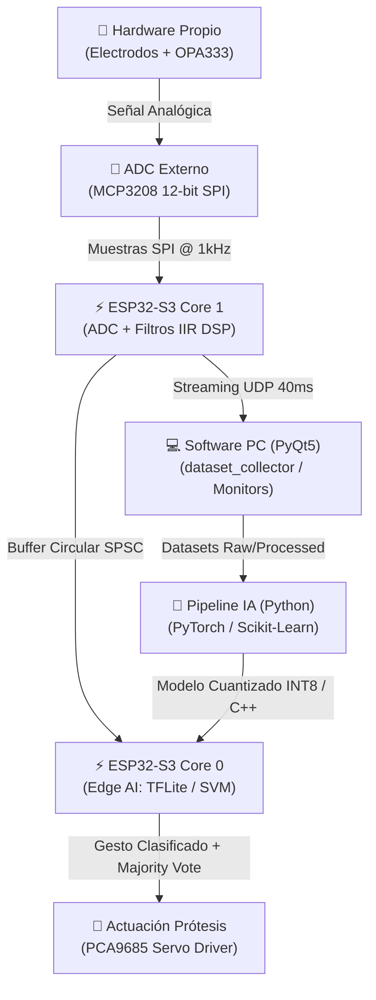

# MyoTensor — Ecosistema Embebido de Inteligencia Artificial para Clasificación sEMG y Control Prostético

> **Proyecto de Título** — Sistema end-to-end de adquisición de señales electromiográficas de superficie (sEMG), procesamiento digital en tiempo real (DSP), entrenamiento de Inteligencia Artificial e inferencia embebida (*Edge AI*) sobre **ESP32-S3** para el control de prótesis robóticas de mano.

---

> [!IMPORTANT]
> **Hardware de Elaboración Propia en Laboratorio**: Todo el sistema de acondicionamiento analógico de señal, biopotenciales y conversión A/D ha sido diseñado, ruteado, fabricado y validado en laboratorio desde cero, adaptándose a las necesidades de captura sEMG de alta fidelidad y baja latencia.

---

## 📋 Tabla de Contenidos
- [Visión General del Ecosistema](#-visión-general-del-ecosistema)
- [🔬 Hardware Analógico y Adquisición (Elaboración Propia)](#-hardware-analógico-y-adquisición-elaboración-propia)
- [🛠️ Estructura del Repositorio](#️-estructura-del-repositorio)
- [⚡ Arquitectura del Firmware (FreeRTOS Dual-Core)](#-arquitectura-del-firmware-freertos-dual-core)
- [🧠 Pipeline de Inteligencia Artificial & Edge AI](#-pipeline-de-inteligencia-artificial--edge-ai)
- [📊 Software de Adquisición y Protocolo de Entrenamiento](#-software-de-adquisición-y-protocolo-de-entrenamiento)
- [🌐 Protocolo de Comunicación UDP](#-protocolo-de-comunicación-udp)
- [🚀 Guía de Instalación y Uso](#-guía-de-instalación-y-uso)
- [📌 Estado del Proyecto](#-estado-del-proyecto)

---

## 🌟 Visión General del Ecosistema

MyoTensor aborda el desafío del control intuitivo de prótesis biomecánicas de mano combinando hardware analógico a medida con capacidades de cómputo en el borde (*Edge AI*). El ecosistema cubre toda la cadena de valor:



---

## 🔬 Hardware Analógico y Adquisición (Elaboración Propia)

A diferencia de soluciones comerciales prefabricadas (ej. Myo Armband o módulos analógicos genéricos), el circuito de captura y acondicionamiento electromiográfico de MyoTensor fue **desarrollado íntegramente en laboratorio**:

* **Etapa de Acondicionamiento Analógico**:
  * Amplificador operacional de precisión **OPA333** (tecnología *Zero-Drift*, ultra-bajo nivel de ruido y offset, alimentación *Single-Supply*).
  * Centrado de señal con tensión de referencia $V_{REF} \approx 1.48\text{ V}$ ($\approx 1837$ cuentas del ADC).
  * Topologías de filtrado analógico secundario para supresión de interferencias de modo común.
* **Conversión Analógico-Digital (ADC)**:
  * Integración con conversor de 12 bits de resolución **MCP3208** operando sobre un bus SPI dedicado a **1.0 kHz** de frecuencia de muestreo por canal.
* **Procesamiento Embebido (SoC)**:
  * Módulo **Seeed Studio XIAO ESP32-S3** (microprocesador Tensilica Xtensa LX7 dual-core @ 240 MHz con extensiones vectoriales SIMD y soporte PSRAM).

---

## 🛠️ Estructura del Repositorio

```text
MyoTensor_Tesis/
├── hardware/                        # Diseños analógicos elaborados en laboratorio
│   ├── schematics/                  # Esquemáticos en PDF (versiones V1 a V6)
│   ├── gerbers/                     # Archivos de fabricación de PCB
│   └── datasheets/                  # Hojas de datos de componentes (OPA333, MCP3208, ESP32-S3)
│
├── firmware/                        # C++ / PlatformIO / FreeRTOS para ESP32-S3
│   ├── Classifier/                  # Firmware de Inferencia Edge AI (Core 1 ADC/DSP + Core 0 TFLite/SVM)
│   ├── Streamer/                    # Firmware de adquisición y transmisión inalambrica UDP @ 1kHz
│   └── plotter_emg/                 # Firmware ligero para visualización rápida por Puerto Serial
│
├── intelligence/                    # Pipeline de Deep Learning y Machine Learning (Python)
│   ├── datasets/                    # Datasets sEMG (NinaPro DB5 y MyoTensor Proto custom)
│   ├── notebooks/                   # Jupyter Notebooks de exploración y entrenamiento
│   └── src/                         # Código fuente modular (config, dataset, features, models)
│
├── tools/                           # Suite de monitoreo y recolección en tiempo real (PyQt5)
│   ├── dataset_collector/           # GUI de adquisición guiada por protocolo + calibración de ruido/MVC
│   ├── emg_monitor.py               # Osciloscopio sEMG en tiempo real (pyqtgraph + UDP/Serial)
│   ├── classifier_monitor.py        # Telemetría de clasificaciones de gestos en tiempo real por UDP
│   └── requirements.txt             # Dependencias Python
│
├── docs/                            # Documentación técnica y metodológica
│   ├── metodologia_adquisicion.md   # Especificación técnica detallada de firmware, software y protocolo
│   └── images/                      # Diagramas y capturas de pantalla
│
└── conceptos/                       # Pruebas de concepto y scripts auxiliares
```

---

## ⚡ Arquitectura del Firmware (FreeRTOS Dual-Core)

El firmware utiliza una arquitectura asíncrona dual-core sobre FreeRTOS para garantizar un muestreo rígido a 1 kHz sin pérdidas (*jitter-free*):

1. **Core 1 (Tarea de Adquisición - `taskAcquisicion` @ 1kHz, Prioridad Alta 5)**:
   * **Muestreo por Hardware**: Temporizador `vTaskDelayUntil` a 1000 Hz exactos.
   * **Procesamiento DSP**:
     * Sustracción de offset continuo ($V_{REF} \approx 1.48\text{ V}$).
     * Filtro Notch IIR (50 Hz) para interferencia eléctrica.
     * Filtro Pasa-Altos IIR (20 Hz) para artefactos de movimiento.
     * Filtro Pasa-Bajos IIR (450 Hz) para atenuación antialiasing.
   * **Buffer Circular SPSC**: Almacenamiento contiguo *lock-free* en SRAM/PSRAM (máscara de bits para velocidad ultra-rápida).
2. **Core 0 (Tarea de Inferencia / Streaming - Prioridad Media 3)**:
   * **Modo Streamer**: Agrupa lotes (`BATCH_SIZE = 40` muestras, 40 ms) y transmite paquetes UDP binarios sin bloquear la adquisición.
   * **Modo Classifier**: Extrae ventanas temporales, ejecuta escalado Z-Score optimizado con SIMD (`fma`), realiza la inferencia (1D-CNN TFLite Micro / SVM / RF), aplica **Votación Mayoritaria** ($N=5$) para suavizado temporal y envía órdenes I2C al driver **PCA9685** de los servos.

---

## 🧠 Pipeline de Inteligencia Artificial & Edge AI

El ecosistema permite entrenar modelos en Python y exportarlos directamente a C++ para ejecución embebida:

### 1. Extracción de Características Temporales
Para modelos clásicos (SVM, RF), se extraen 6 descriptores fundamentales por ventana:
* **MAV** (*Mean Absolute Value*)
* **RMS** (*Root Mean Square*)
* **WL** (*Waveform Length*)
* **ZC** (*Zero Crossings* con umbral adaptativo de ruido)
* **SSC** (*Slope Sign Changes*)
* **VAR** (*Variance*)

### 2. Modelos Embebidos Soportados
* **1D-CNN (TensorFlow Lite Micro)**: Entrada directa de la ventana de tiempo ($W=300$ ms, $F_s=1$ kHz). Cuantización INT8 y fusión de escalado `Z-Score + Quantization` en una sola instrucción vectorial del ESP32-S3.
* **SVM / Random Forest**: Generados en C++ nativo vía `micromlgen`.

### 3. Gestos Clasificados
1. **Reposo** (Mano relajada)
2. **Palma Abierta** (Extensión digital)
3. **Puño Cerrado** (Flexión digital)
4. **Gesto de Paz / Victoria** (Extensión selectiva de dedos)

---

## 📊 Software de Adquisición y Protocolo de Entrenamiento

Ubicado en `tools/dataset_collector/`, provee una interfaz gráfica completa en **PyQt5** con una máquina de estados finitos que guía al usuario en el protocolo de recolección de datos:

```text
[Inicio] ──> [Calibración Ruido (5s)] ──> [Calibración MVC (3s)] ──> [Pausa Transición (2s)] ──> [Sets 1 a 10] ──> [Fin de Sesión]
```

* **Calibración de Ruido Basal**: Establece el umbral de detección de la señal en reposo.
* **Calibración de MVC (Máxima Contracción Voluntaria)**: Normaliza la amplitud del EMG al rango dinámico del usuario.
* **Sets Aleatorizados (Randomized Block Design)**: 10 bloques con permutaciones aleatorias de gestos (3s Descanso / 5s Gesto Activo) para evitar fatiga muscular o adaptación neuronal.

---

## 🌐 Protocolo de Comunicación UDP

El streaming inalámbrico opera sobre UDP con una trama binaria liviana de **172 bytes** (*Little-Endian*):

| Campo | Tipo de Dato | Tamaño | Descripción |
|---|---|---|---|
| **Magic Word** | `uint16` | 2 bytes | Cabecera de sincronismo (`0xEB90`) |
| **N° Muestras** | `uint8` | 1 byte | Cantidad de muestras en payload ($N=40$) |
| **Reservado** | `uint8` | 1 byte | Byte de alineación (`0x00`) |
| **Secuencia** | `uint32` | 4 bytes | Contador de paquetes (detección de pérdidas de red) |
| **Timestamp** | `uint32` | 4 bytes | Tiempo de inicio del lote en microsegundos |
| **Payload** | `float32[40]` | 160 bytes | Array de 40 muestras filtradas por el DSP |

---

## 🚀 Guía de Instalación y Uso

### 1. Entornos Python y Dependencias
```bash
# Clonar el repositorio
git clone https://github.com/elSebee/MyoTensor_Tesis.git
cd MyoTensor_Tesis/

# Crear entorno virtual e instalar dependencias
python -m venv venv
source venv/bin/activate  # En Linux/macOS
pip install -r tools/requirements.txt
```

### 2. Flasheo del Firmware (PlatformIO)
Para compilar y cargar el firmware al XIAO ESP32-S3:
```bash
# Para modo Streaming UDP de datos sEMG a 1 kHz:
cd firmware/Streamer
pio run -t upload

# Para modo Inferencia Edge AI (Clasificador de gestos embebido):
cd ../Classifier
pio run -t upload
```

### 3. Ejecución de Herramientas de Monitoreo
```bash
cd tools/

# Osciloscopio en tiempo real (Autodetecta Serial o escucha UDP):
python emg_monitor.py

# Colector gráfico de datasets para entrenamiento:
python -m dataset_collector.main

# Monitor de telemetría de inferencias en tiempo real por UDP:
python classifier_monitor.py
```

---

## 📌 Estado del Proyecto

- [x] Diseños de esquemáticos analógicos e integración de componentes en laboratorio (OPA333 + MCP3208).
- [x] Firmware FreeRTOS dual-core para adquisición 1 kHz, filtrado IIR (Notch + HPF + LPF) y ring buffer SPSC.
- [x] Protocolo de comunicación UDP de ultra-baja latencia y handshake unicast.
- [x] Suite gráfica de adquisición de datos en Python (`dataset_collector`) con calibración de ruido basal y MVC.
- [x] Pipeline de entrenamiento en Python (PyTorch/Scikit-Learn) y extracción de características temporales.
- [x] Inferencia embebida Edge AI (TFLite Micro 1D-CNN / SVM) en ESP32-S3 con Votación Mayoritaria.
- [ ] Integración completa con driver I2C PCA9685 y servomotores MG996R en prótesis biomecánica 3D.

---

### 📝 Licencia y Reconocimiento
Este trabajo forma parte de una **Tesis de Título Universitaria** basada y evolucionada a partir de los conceptos del proyecto MyoTensor. Desarrollado en laboratorio.